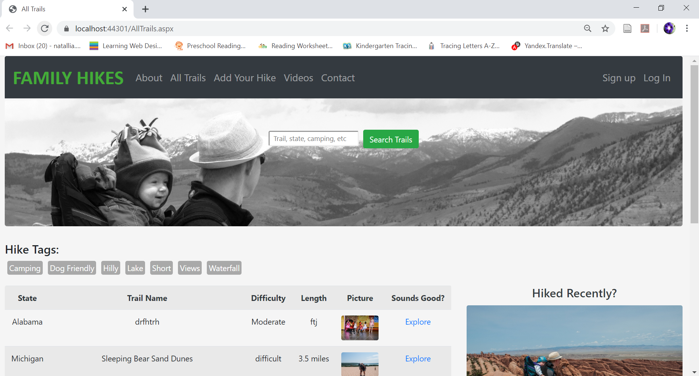

# FamilyHikes2019
# @author: Natallia Akulenka
# ASP.NET, C# for the server-side code, Bootstrap for styling, ACCESS for data storing, SQL for accessing the data

This project was a MS course project on developing a web application with user-generated content. I created a project "FamilyHikes", which is a social networking website for families who like hiking. It allows users to share information and experiences about trails to hike with children in the U.S. The target user group are families with children who enjoy the outdoors. The website purposes are to bring new ideas for family-oriented hiking, enable users to meet people with similar interests, and to save some time spent searching information.

In this website, any user could read information posted on the website but, in order to share information or comment somebody’s posting, the user would need to register on the website. Registered users can post information about trails and comment other postings. 
Any user can search content using the search text field option or go through the information on the All Trails page, which displays a list of hiking trails including main trail features, e.g., trail name, the state where the trail is located, top features, length, hiking duration, difficulty and picture. The user can sort listed hikes by a selected column (e.g. sort all trails by the state). From this main page, the user can navigate to a page showing detailed information about a particular trail including description in details and additional pictures, hiking tips, author name and date of publishing. In order to make it easier for the users to find the content they are particularly interested in, the information on the website is tagged with topic areas (e.g.short, waterfall, camping, etc.).

